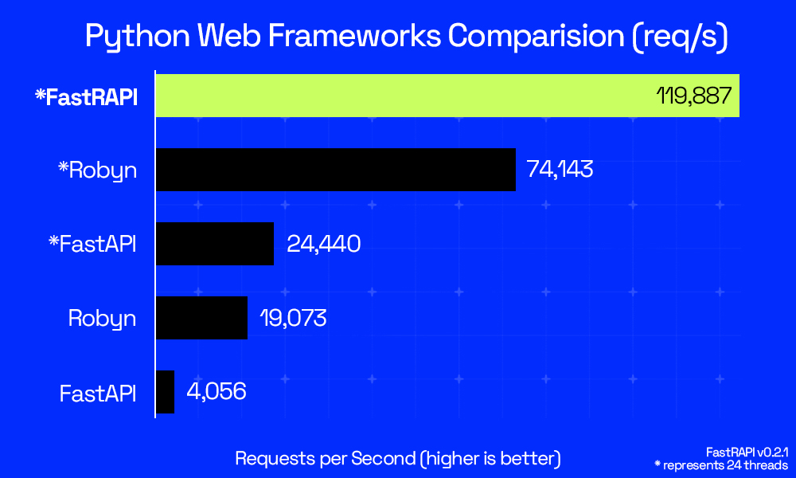

# FastrAPI (Fast + Rust + API)

[](https://pepy.tech/projects/fastrapi)


FastrAPI is a high-performance web framework that supercharges your Python APIs with the power of Rust. Built on Axum and PyO3, it delivers unmatched speed, type safety, and developer-friendly Python syntax. Create robust, async-ready APIs with minimal overhead and maximum throughput. FastrAPI is your drop-in replacement for FastAPI, offering familiar syntax with up to 33x faster performance.

## Key Features

- **Lightning Speed**: Powered by Rust and Axum, FastrAPI delivers up to **33x faster** performance than FastAPI, making your APIs scream.
- **Python-First**: Write clean, familiar Python code, no Rust knowledge needed. FastrAPI handles the heavy lifting behind the scenes.
- **Ironclad Type Safety**: Inherits Rust's robust type system for rock-solid reliability, catching errors before they hit production.
- **Pydantic Powered**: Seamless integration with Pydantic for effortless request and response validation, keeping your data in check.
- **Async Native**: Built on Tokio's async runtime, FastrAPI maximizes concurrency for handling thousands of requests with ease.
- **Ultra Lightweight**: Minimal runtime overhead with maximum throughput.
- **Drop-in Replacement**: Drop-in compatibility with FastAPI's beloved decorator syntax, so you can switch without rewriting your codebase.

---

#### Is it as fast as claimed?
Yes. Powered by Rust and Axum, FastrAPI outperforms FastAPI by up to 33x in real-world benchmarks, with no compromises on usability. Check it out [here](https://github.com/ppmpreetham/fastrapi?tab=readme-ov-file#performance)



#### Do I need to know Rust?
Nope. FastrAPI lets you write 100% Python code while leveraging Rust's performance under the hood.

#### Can it handle complex APIs?
Absolutely. With full Pydantic integration and async support, FastrAPI scales effortlessly for small projects and enterprise-grade APIs alike.

#### Will it keep up with FastAPI updates?
Yes. FastrAPI mirrors FastAPI's decorator-based syntax, ensuring compatibility and instant access to familiar workflows.

## Installation

### uv
```bash
uv install fastrapi
```

### pip
```bash
pip install fastrapi
```

### Switch from FastAPI

```diff
- from fastapi import FastAPI
+ from fastrapi import FastrAPI
```

## Get Started

```python
from fastrapi import FastrAPI
app = FastrAPI()

@app.get("/hello")
def hello():
    return {"Hello": "World"}

@app.post("/echo")
def echo(data):
    return {"received": data}

if __name__ == "__main__":
    app.serve("127.0.0.1", 8080)
```

### Now, test it with:
```bash
curl http://127.0.0.1:8080/hello
```

For the `POST` endpoint:
```bash
curl --location 'http://127.0.0.1:8080/echo' \
--header 'Content-Type: application/json' \
--data '{"foo": 123, "bar": [1, 2, 3]}'
```


<details>
  <summary>Show Pydantic example</summary>

```python
from pydantic import BaseModel
from fastrapi import FastrAPI

api = FastrAPI()

class User(BaseModel):
    name: str
    age: int

@api.post("/create_user")
def create_user(data: User):
    return {"msg": f"Hello {data.name}, age {data.age}"}

api.serve("127.0.0.1", 8080)
```

</details>


<details>
  <summary>Show ResponseTypes Example</summary>

```python
from fastrapi import FastrAPI
from fastrapi.responses import HTMLResponse, JSONResponse

api = FastrAPI()

@api.get("/html")
def get_html() -> HTMLResponse:
    return HTMLResponse("<h1>Hello</h1>")

api.serve("127.0.0.1", 8080)
```

</details>

<details>
  <summary>Show Middleware Example</summary>

```python
from fastrapi import FastrAPI
from fastrapi.responses import JSONResponse

from fastrapi.middleware import (
    CORSMiddleware,
    TrustedHostMiddleware,
    GZipMiddleware,
    SessionMiddleware
)

app = FastrAPI()

# TrustedHost Middleware
app.add_middleware(
    TrustedHostMiddleware, 
    allowed_hosts=["127.0.0.1", "localhost", "127.0.0.1:8000"],
    www_redirect=True
)

# CORS Middleware
app.add_middleware(
    CORSMiddleware,
    allow_origins=["*"],
    allow_methods=["GET", "POST"],
    allow_headers=["*"],
    allow_credentials=False
)

# 3. GZip Middleware
app.add_middleware(
    GZipMiddleware, 
    minimum_size=500,
    compresslevel=9
)

# 4. Session Middleware
app.add_middleware(
    SessionMiddleware,
    secret_key="super-duper-secret-key-change-this-in-prod-pwease-uwu-BUT-MAKE-IT-LONGER-NOW",
    session_cookie="fastrapi_session",
    max_age=3600,
    https_only=False
)

# ROUTES
# WARNING: ALWAYS return JSONResponse if it's JSON, to ensure proper serialization
@app.get("/")
def index() -> JSONResponse:
    return JSONResponse({"status": "running"})

@app.get("/heavy")
def heavy_data() -> JSONResponse:
    # response large enough to trigger GZip compression
    large_data = "x" * 1000
    return JSONResponse({
        "data": large_data,
        "note": "Check content-encoding header!"
    })

# Session Test: Increment a counter stored in the cookie
@app.get("/counter")
def session_counter(request) -> JSONResponse:
    # For now, this verifies the Middleware sets the cookie correctly.
    return JSONResponse({"message": "Session cookie should be set"})

if __name__ == "__main__":
    app.serve("127.0.0.1", 8000)

# Test with:
# curl -v -H "Host: 127.0.0.1" http://127.0.0.1:8000/
# curl -v -H "Origin: http://example.com" http://127.0.0.1:8000/
```

</details>

## Performance
Benchmarks using [k6](https://k6.io/) show it outperforms FastAPI + Guvicorn across multiple worker configurations.

### 🖥️ Test Environment
- **Kernel:** 6.16.8-arch3-1  
- **CPU:** AMD Ryzen 7 7735HS (16 cores, 4.83 GHz)  
- **Memory:** 15 GB  
- **Load Test:** 20 Virtual Users (VUs), 30s  

### ⚡ Benchmark Results

| Framework                              | Avg Latency (ms) | Median Latency (ms) | Requests/sec | P95 Latency (ms) | P99 Latency (ms) |
|----------------------------------------|------------------|---------------------|---------------|------------------|------------------|
| **FASTRAPI**                           | **0.59**         | **0.00**            | **31360**     | **2.39**         | **11.12**        |
| FastAPI + Guvicorn (workers: 1)        | 21.08            | 19.67               | 937           | 38.47            | 93.42            |
| FastAPI + Guvicorn (workers: 16)       | 4.84             | 4.17                | 3882          | 10.22            | 81.20            |

> **TLDR;** FASTRAPI handles thousands of requests per second with ultra-low latency ,  making it **~33× faster** than FastAPI + Guvicorn with 1 worker.

## Current Limitations
Some advanced features are still in development like:
- [ ] Logging/metrics
- [ ] A nice logging tool
- [ ] Better error handling (currently shows Rust errors)
- [ ] Rate limiter (even FastAPI doesn't have it)
- [ ] Websockets
- [ ] Dependency injection
- [ ] Static file serving
- [ ] Background tasks
- [ ] Testing support
- [ ] GraphQL support

## Contributing
Contributions are welcome! Please feel free to submit a Pull Request.

- Fork the repository
- Create your feature branch (git checkout -b feature/amazing-feature)
- Commit your changes (git commit -m 'Add some amazing feature')
- Push to the branch (git push origin feature/amazing-feature)
- Open a Pull Request

Check out [CONTRIBUTING.md](CONTRIBUTING.md) for more details.

## License
This project is licensed under the MIT License - see the [LICENSE](LICENSE) file for details.

## Acknowledgments
Inspired by [FastAPI](https://github.com/fastapi/fastapis)
Built with [PyO3](https://github.com/PyO3/pyo3/) and [Axum](https://github.com/tokio-rs/axum/)

## Star History
[](https://star-history.com/#ppmpreetham/fastrapi&Date)