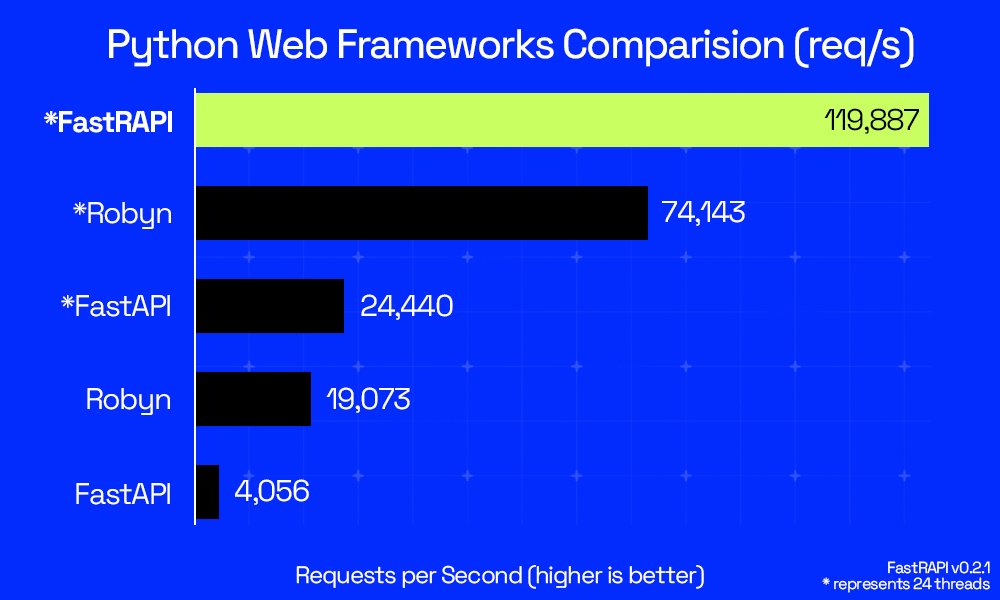

# FastrAPI (Fast + Rust + API)

[](https://pepy.tech/projects/fastrapi)


FastrAPI is a high-performance web framework that supercharges your Python APIs with the power of Rust. Built on Axum and PyO3, it delivers unmatched speed, type safety, and developer-friendly Python syntax. Create robust, async-ready APIs with minimal overhead and maximum throughput. FastrAPI is your drop-in replacement for FastAPI, offering familiar syntax with up to 6x faster performance.

## Key Features

- **High Speed**: Powered by Rust and Axum, FastrAPI delivers up to **6x faster** performance than FastAPI, making your APIs scream.
- **Python First**: Write same Python code, 0 Rust knowledge needed. FastrAPI handles the heavy lifting behind the scenes.
- **Pydantic Powered**: Seamless integration with Pydantic for effortless request and response validation, keeping your data in check.
- **Async Native**: Built on Tokio's async runtime, FastrAPI maximizes concurrency for handling thousands of requests with ease.
- **Ultra Lightweight**: Minimal runtime overhead with maximum throughput.
- **Drop in Replacement**: Drop in compatibility with the same FastAPI's beloved decorator syntax, so you can switch without rewriting your codebase.
- **Middleware Support**: `tower-http` support for CORS, GZip, Session, and TrustedHost middleware.

---

#### Is it as fast as claimed?

Yes. Powered by Rust and Axum, FastrAPI outperforms FastAPI by up to 6x in real-world benchmarks, with no compromises on usability. Check it out [here](https://github.com/ppmpreetham/fastrapi?tab=readme-ov-file#performance)



#### Do I need to know Rust?

Nope. FastrAPI lets you write 100% Python code while still leveraging Rust's performance under the hood.

#### Can it handle complex APIs?

Absolutely, FastrAPI scales effortlessly for small projects and massive enterprise grade APIs alike.

#### Will it keep up with FastAPI updates?

Yes. FastrAPI mirrors FastAPI's syntax, ensuring compatibility and instant access to workflows.

## Installation

### uv

```bash
uv install fastrapi
```

### pip

```bash
pip install fastrapi
```

### Build from Source

```bash
maturin build --release --pgo --generate-stubs
```

### Switch from FastAPI

```diff
- from fastapi import FastAPI
+ from fastrapi import FastrAPI
```

## Get Started

```python
from fastrapi import FastrAPI
app = FastrAPI()

@app.get("/hello")
def hello():
    return {"Hello": "World"}

@app.get("/healthz", cache_resp=True)
def healthz():
    return {"ok": True}

@app.post("/echo")
def echo(data):
    return {"received": data}

if __name__ == "__main__":
    app.serve("127.0.0.1", 8000)
```

### Now, test it with:

```bash
curl http://127.0.0.1:8000/hello
```

For the `POST` endpoint:

```bash
curl --location 'http://127.0.0.1:8000/echo' \
--header 'Content-Type: application/json' \
--data '{"foo": 123, "bar": [1, 2, 3]}'
```

<details>
  <summary>Show Pydantic example</summary>

```python
from pydantic import BaseModel
from fastrapi import FastrAPI

api = FastrAPI()

class User(BaseModel):
    name: str
    age: int

@api.post("/create_user")
def create_user(data: User):
    return {"msg": f"Hello {data.name}, age {data.age}"}

api.serve("127.0.0.1", 8000)
```

</details>

<details>
  <summary>Show ResponseTypes Example</summary>

```python
from fastrapi import FastrAPI
from fastrapi.responses import HTMLResponse, JSONResponse

api = FastrAPI()

@api.get("/html")
def get_html() -> HTMLResponse:
    return HTMLResponse("<h1>Hello</h1>")

api.serve("127.0.0.1", 8000)
```

</details>

<details>
  <summary>Show Middleware Example</summary>

```python
from fastrapi import FastrAPI
from fastrapi.responses import JSONResponse

from fastrapi.middleware import (
    CORSMiddleware,
    TrustedHostMiddleware,
    GZipMiddleware,
    SessionMiddleware
)

app = FastrAPI()

# TrustedHost Middleware
app.add_middleware(
    TrustedHostMiddleware,
    allowed_hosts=["127.0.0.1", "localhost", "127.0.0.1:8000"],
    www_redirect=True
)

# CORS Middleware
app.add_middleware(
    CORSMiddleware,
    allow_origins=["*"],
    allow_methods=["GET", "POST"],
    allow_headers=["*"],
    allow_credentials=False
)

# 3. GZip Middleware
app.add_middleware(
    GZipMiddleware,
    minimum_size=500,
    compresslevel=9
)

# 4. Session Middleware
app.add_middleware(
    SessionMiddleware,
    secret_key="super-duper-secret-key-change-this-in-prod-pwease-uwu-BUT-MAKE-IT-LONGER-NOW",
    session_cookie="fastrapi_session",
    max_age=3600,
    https_only=False
)

# ROUTES
@app.get("/")
def index() -> JSONResponse:
    return JSONResponse({"status": "running"})

@app.get("/heavy")
def heavy_data() -> JSONResponse:
    # response large enough to trigger GZip compression
    large_data = "x" * 1000
    return JSONResponse({
        "data": large_data,
        "note": "Check content-encoding header!"
    })

# Session Test: Increment a counter stored in the cookie
@app.get("/counter")
def session_counter(request) -> JSONResponse:
    # For now, this verifies the Middleware sets the cookie correctly.
    return JSONResponse({"message": "Session cookie should be set"})

if __name__ == "__main__":
    app.serve("127.0.0.1", 8000)

# Test with:
# curl -v -H "Host: 127.0.0.1" http://127.0.0.1:8000/
# curl -v -H "Origin: http://example.com" http://127.0.0.1:8000/
```

</details>

<details>
  <summary>Show Lifespan Example</summary>

```python
from contextlib import asynccontextmanager
from fastrapi import FastrAPI

shared = {}

@asynccontextmanager
async def lifespan(app: FastrAPI):
    shared["ready"] = True
    app.title = "FastrAPI && lifespan"
    try:
        yield
    finally:
        shared.clear()

app = FastrAPI(lifespan=lifespan)

@app.get("/health")
def health():
    return {"ready": shared.get("ready", False), "title": app.title}

app.serve("127.0.0.1", 8080)
```

If you provide `lifespan=...`, `on_startup` and `on_shutdown` handlers are not called.

</details>

<details>
  <summary>Show Startup / Shutdown Example</summary>

```python
from fastrapi import FastrAPI

events = []

def startup():
    events.append("startup")

async def shutdown():
    events.append("shutdown")

app = FastrAPI(
    on_startup=[startup],
    on_shutdown=[shutdown],
)

@app.get("/events")
def get_events():
    return {"events": events}

app.serve("127.0.0.1", 8080)
```

</details>

### Startup-Precomputed Routes

Use `cache_resp=True` only for immutable responses. FastrAPI calls the handler during startup, stores the rendered response bytes and headers, and serves that route through a no-Python Axum path.

```python
@app.get("/", cache_resp=True)
def hello():
    return {"Hello": "World"}
```

## Performance

Benchmarks using [k6](https://k6.io/) show it outperforms FastAPI + Guvicorn across multiple worker configurations.

### Benchmarking Locally

For real benchmark numbers, build the PyO3 extension in release mode first:

```bash
maturin develop --release
python examples/basic.py
k6 run benchmarks/stress.js
```

If you benchmark a debug build, Rust-side overhead will be much higher and the numbers will be misleading.

### 🖥️ Test Environment

- **Kernel:** 6.16.8-arch3-1
- **CPU:** AMD Ryzen 7 7735HS (16 cores, 4.83 GHz)
- **Memory:** 15 GB
- **Load Test:** 20 Virtual Users (VUs), 30s

### ⚡ Benchmark Results

| Framework                        | Avg Latency (ms) | Median Latency (ms) | Requests/sec | P95 Latency (ms) | P99 Latency (ms) |
| -------------------------------- | ---------------- | ------------------- | ------------ | ---------------- | ---------------- |
| **FASTRAPI**                     | **0.59**         | **0.00**            | **31360**    | **2.39**         | **11.12**        |
| FastAPI + Guvicorn (workers: 1)  | 21.08            | 19.67               | 937          | 38.47            | 93.42            |
| FastAPI + Guvicorn (workers: 16) | 4.84             | 4.17                | 3882         | 10.22            | 81.20            |

> **TLDR;** FASTRAPI can handle thousands of requests per second with ultra-low latency , making it **~6× faster** than FastAPI + Guvicorn.

## Comparison: FastAPI vs FastRAPI

| Area                                                | FastAPI                                                        | FastRAPI                                                                           | FastRAPI wins?                    |
| --------------------------------------------------- | -------------------------------------------------------------- | ---------------------------------------------------------------------------------- | --------------------------------- |
| Dependency resolution                               | Runtime `inspect` + reflection every request                   | One time parsing at startup, pre-built injection plan later                        | 🟢                                |
| fast path for trivial endpoints                     | No cases and full `kwargs`/`dependency` work always at runtime | mini compiler to skip deps, validation, kwargs, middlewares if required at startup | 🟢                                |
| Route lookup speed                                  | Starlette regex router (slows with many routes)                | `papaya` concurrent hashmap + radix trie lookup                                    | 🟢                                |
| Middleware usability (Python)                       | `@app.middleware` often buggy / limited                        | working decorator + `tower-http` api                                               | 🟢                                |
| Background tasks reliability                        | Fire 'n forget, errors usually swallowed                       | proper `JoinHandle` + error logging                                                | 🟢                                |
| WebSocket implementation                            | Starlette (solid but heavy)                                    | custom with bounded channels + clean async pump                                    | 🟢                                |
| Startup-time error detection                        | Almost everything deferred to runtime                          | Full signature + dependency analysis at decorator time                             | 🟢                                |
| Deployment footprint                                | Heavy (uvicorn + many deps)                                    | tiny Rust binary                                                                   | 🟢                                |
| Scaling to 10,000+ routes                           | Noticeable slowdown                                            | Stays fast thanks to hashmap lookup                                                | 🟢                                |
| JSON serialization speed                            | slow                                                           | fast thanks to `sonic-rs`                                                          | 🟢                                |
| Prometheus metrics endpoint                         | No                                                             | Yes                                                                                | 🟢                                |
| Exception Handlers (`@app.exception_handler`)       | Yes, global error catching                                     | Full support (plus Axum `.fallback()` alias)                                       | 🟡                                |
| `APIRouter` + `include_router()`                    | Yes, mature ecosystem                                          | Full support                                                                       | 🟡                                |
| `StreamingResponse` / SSE                           | Yes, chunked streaming                                         | Full support (async & sync generators)                                             | 🟡                                |
| Frontend serving support (React, Vue, Svelte, etc.) | Yes                                                            | Yes                                                                                | 🟡                                |
| Global State (`request.app.state`)                  | Yes                                                            | Full support                                                                       | 🟡                                |
| `response_model=None` + raw Response return         | Fully supported                                                | serialization                                                                      | 🔴 (for now)                      |
| Concurrency & resource safety                       | asyncio + threadpool                                           | Native Tokio + Rust memory & thread safety                                         | 🔴 (slow due to context switches) |
| `app.mount()` / `StaticFiles`                       | Yes                                                            | Not yet implemented                                                                | 🔴 (for now)                      |

<!-- frontend, prometheus, rate limiting -->

## Current Limitations

Some advanced features are still in development like:

- [x] Built-in middleware setup (`add_middleware` for CORS, GZip, Session, TrustedHost)
- [x] Lifespan Events (`lifespan=`, `on_startup`, `on_shutdown`)
- [x] Rate limiter (better to do from ngnix)
- [x] Websockets
- [x] Form/Multipart support
- [x] Generated OpenAPI JSON + Swagger docs (`/api-docs/openapi.json`, `/docs`)
- [x] Sub-APIs / Includes
- [x] Security Utilities (OAuth2, JWT, etc.)
- [x] Rust integration
- [x] Dependency injection
- [x] Route parameter parsing (`Path`, `Query`, body models, `Depends`, `Security`)
- [x] APIRouter + include_router(prefix=..., tags=..., dependencies=...)
- [x] @app.exception_handler() + app.fallback()
- [x] app.state (mutable app-wide state)
- [x] Metrics / Prometheus endpoint
- [ ] Logging middlewares
- [ ] Async Middleware support
- [ ] Full middleware ordering control
- [ ] Better error handling (currently shows Rust errors)
- [ ] Proper Python-friendly error pages (no Rust tracebacks in production)
- [ ] File uploads (`UploadFile` + multipart parsing)
- [ ] GraphQL support
- [ ] Respect response_model=None (allow raw Response / RedirectResponse returns)
- [ ] `app.mount()` for static files & sub-apps
- [ ] `app.openapi()` method (customizable spec)
- [ ] `app.openapi_tags=` ordering in Swagger UI
- [ ] `callbacks=` and `webhooks=` in OpenAPI
- [ ] `app.servers=`, `root_path`, `openapi_external_docs`
- [ ] `app.swagger_ui_parameters=` customization
- [ ] `separate_input_output_schemas` in OpenAPI generation
- [ ] Hot reloading / watchfiles integration
- [ ] Built-in TestClient (`starlette.testclient` style)
- [ ] Advanced dependency scopes (request vs function)
- [ ] Rust to Python FFI helpers

## Contributing

Contributions are welcome! Please feel free to submit a Pull Request.

- Fork the repository
- Create your feature branch (git checkout -b feature/amazing-feature)
- Commit your changes (git commit -m 'Add some amazing feature')
- Push to the branch (git push origin feature/amazing-feature)
- Open a Pull Request

Check out [CONTRIBUTING.md](CONTRIBUTING.md) for more details.

## License

This project is licensed under the MIT License - see the [LICENSE](LICENSE) file for details.

## Acknowledgments

Inspired by [FastAPI](https://github.com/fastapi/fastapis)
Built with [PyO3](https://github.com/PyO3/pyo3/) and [Axum](https://github.com/tokio-rs/axum/)

## Star History

[](https://star-history.com/#ppmpreetham/fastrapi&Date)
